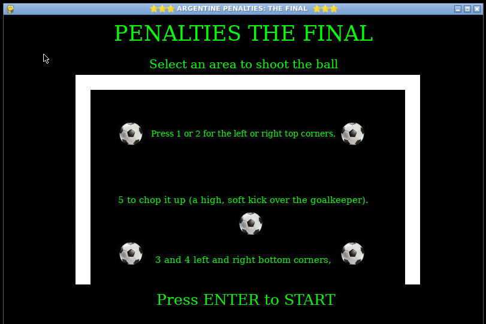
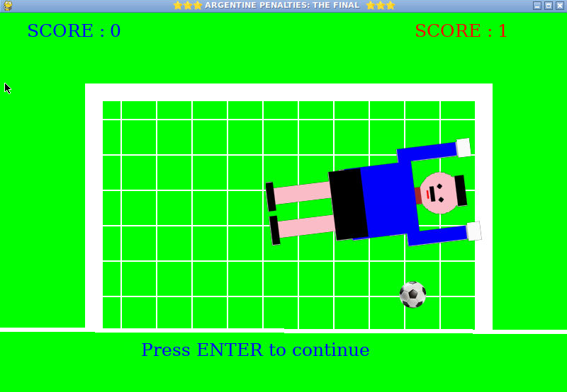
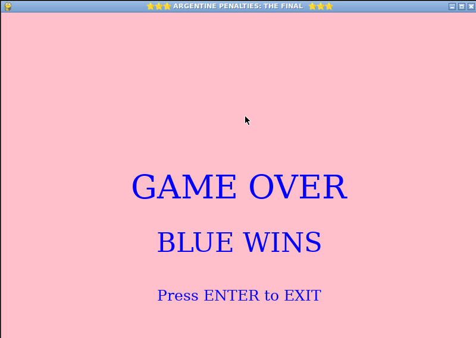

# PENALTIES THE FINAL
 #### Video Demo:  <https://youtu.be/6Zo_NeOgq7M>

 ## Description:

    PENALTIES THE FINAL is an exciting penalty game.
    It's a football shootout game inspired by the 2022 FIFA WORLD CUP Final. It was developed using Python and Pygame as my final project for the Harvard CS50p. this game try to bring the thrill of a match final.
    The game simulates a penalty series for two team players. They choose the shot direction and the goalkeeper randomly choose a area to cover.
    The game simulates a series of 10 penalties five each team. The payers can choose the direction of their shot, while the goalkeeper, contoled by the game logic, ramdomly selects an area to cover.
    With intuitive controls and a simple interface, this game offers a fun experience for players of all skill levels. It also lets you relive the tension of the 2022 World Cup penalty shootout, where every decision can lead you to glory or oblivion.

 ##  Technologies Used
   * Python for logic.
   * Pygame for graphics event handling, and UI.
   * Random for making the goalkeeper decisions.

 ##  Features
   * Turn based for penalty kicks.
   * Dynamic texts to display score and winner announcements.
   * Random goalkeeper decisions for an unpredictable experience.
   * Simple UI.

##  Install
####    pip install pygame

   ##  Install
####    python main.py
   ##  Test pytest
####    test_project.py

   ##  In the cs50 virtual VS
####   open the CS50 menu on the left and click GUI to open the graphic server.

##  GAME RULES

   * Two Players Blue vs. Red.
   * Each player takes five penalties.
   * A goal gives you a point.
   * If the goalkeeper saves your rival gets nothing.
   * The player with the most goals wins.

##  Files

   * ball,py
     A class called Ball thats render an archive assets/ball.png  I decided to include this image to enhance the game's graphics.
   * constants.py
     Screen sizes: HEIGHT and WIDTH.
   * gk_action.py
     A class for the goalkeeper actions thats render an archive .png  I decided to these images to unify the actions.
   * goal_keeper,py
     A class called goal_keeper thats render the original goalkeeper that I created for the game. Renders the goalkeeper in his state of waiting for the penalty for each of the teams.
   * goal.py
     Renders the goal and the net and the linen his state of waiting for the penalty for each of the teams.
   * project.py
     It has the main function of starting the game. It renders the different graphics and texts and instantiates the classes.
     It is the heart of the project.
     It has the logic of the goals or the saves and the random behavior of the goalkeeper. It also listens to the events of the keys used by the game.
   * test_project.py
     A file thats have the test for the function of project.py get_turn, get_goal, get_player, get_player_vs each of them is tested in this file with pytest.

   ##  CAPTURES

